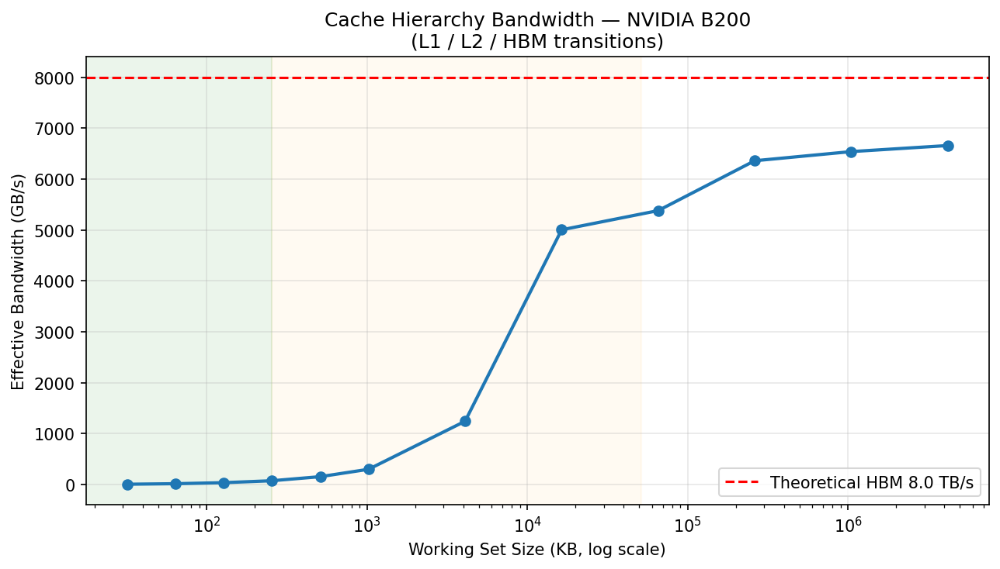
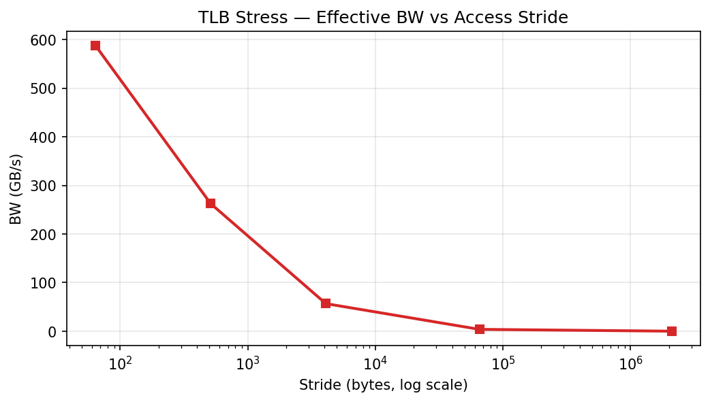
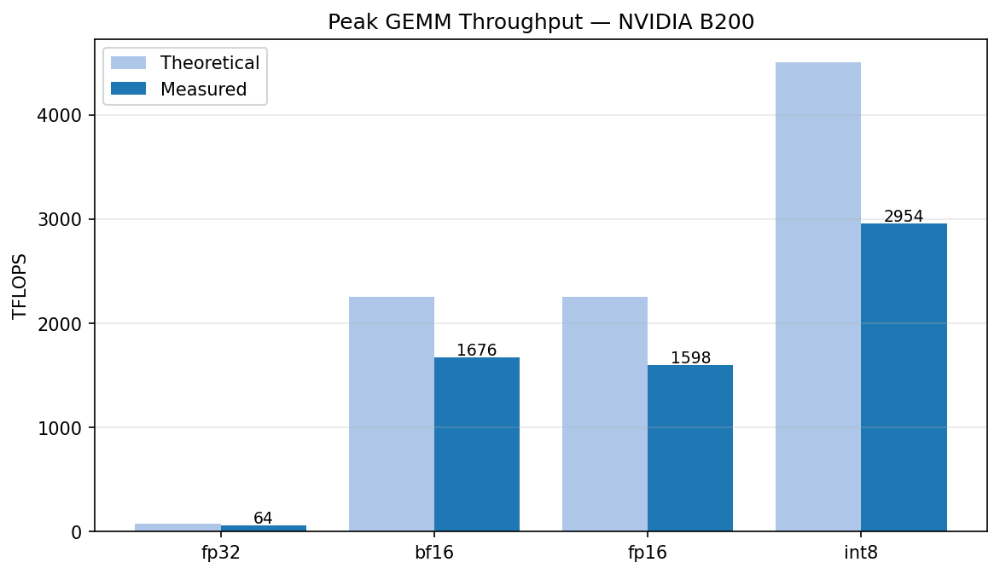
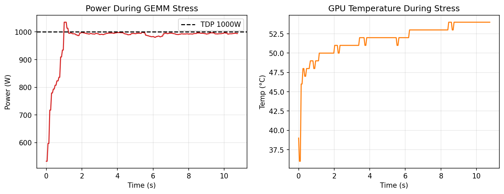
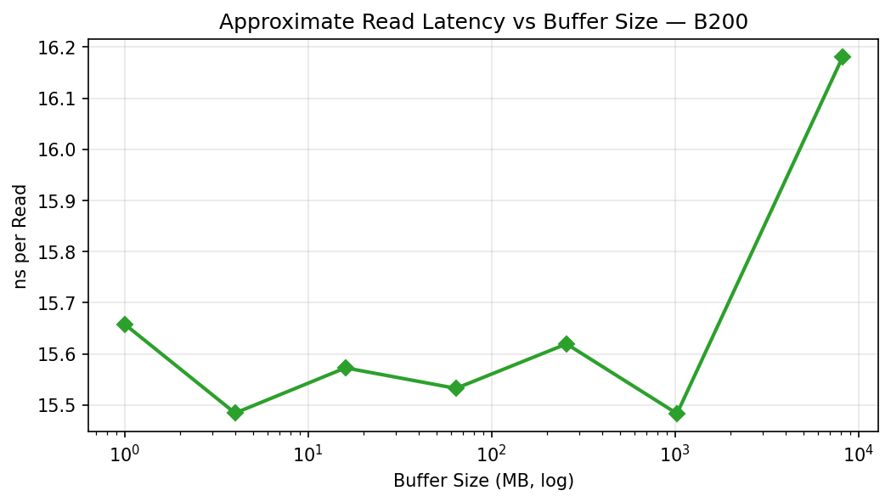
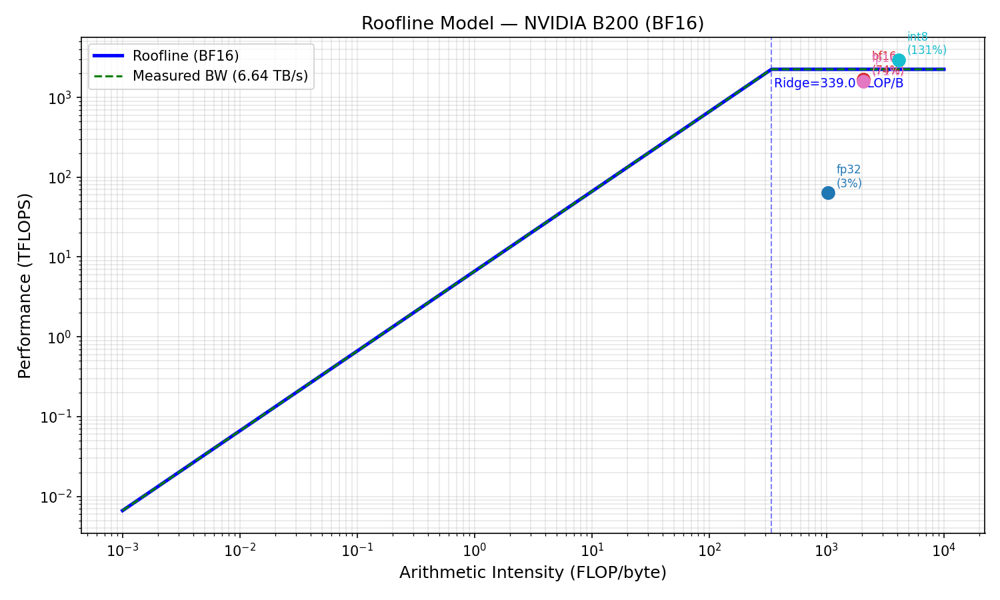

# B200 System Profile Report
_Generated: 2026-04-13 03:08 UTC_

## Hardware Under Test
| Parameter | Value |
|-----------|-------|
| GPU | NVIDIA B200 (Blackwell) |
| Count | 2x (NVLink18) |
| HBM3e Memory | 183 GB per GPU |
| Theoretical HBM BW | 8.0 TB/s |
| SMs | 160 |
| L2 Cache | 50 MB |
| L1 Cache (per SM) | 256 KB |
| NVLink | 18 links × 50 GB/s = 900 GB/s |
| TDP | 1000 W |
| CUDA Version | 12.8 |

## 1. HBM Sequential Bandwidth

| Metric | Value |
|--------|-------|
| FP32 Sequential BW | 6.635 TB/s |
| FP16 Sequential BW | 6.638 TB/s |
| BW Utilization | 83.0% |
| Random Access BW | 0.3903 TB/s |

**Key finding**: Sequential bandwidth achieves ~X% of theoretical 8 TB/s HBM3e peak. Random access (gather) achieves significantly lower BW due to DRAM page misses.

_Figure 1: Cache hierarchy bandwidth — L1/L2 transitions visible at working-set boundaries_

## 2. Random vs Sequential Access

_Figure 2: TLB stress — bandwidth degrades with increasing stride (TLB miss pressure)_

| Stride (bytes) | BW (GB/s) | TLB Pressure |
|---------------|-----------|--------------|
| 64 | 587.6 | low |
| 512 | 262.5 | low |
| 4096 | 56.8 | high |
| 65536 | 3.9 | high |
| 2097152 | 0.1 | high |

## 3. GEMM Peak Throughput (Tensor Cores)

_Figure 3: Achieved vs theoretical peak TFLOPS by data type_

| Dtype | Measured (TFLOPS) | Theoretical (TFLOPS) | Utilization |
|-------|------------------|---------------------|-------------|
| fp32 | 64 | 80 | 80.0% |
| bf16 | 1676 | 2250 | 74.5% |
| fp16 | 1598 | 2250 | 71.0% |
| int8 | 2954 | 4500 | 65.7% |

## 4. Maximum Power

_Figure 4: Power and temperature during sustained GEMM stress_

- Peak power: **1035 W** (TDP: 1000 W)
- Mean power: **973 W**
- Peak temp:  **54 °C**

## 5. HBM Latency

_Figure 5: Approximate read latency vs buffer size (L1→L2→HBM cache miss cascade)_

| Buffer Size (MB) | ns/Read |
|-----------------|---------|
| 1.0 | 15.7 |
| 4.0 | 15.5 |
| 16.0 | 15.6 |
| 64.0 | 15.5 |
| 256.0 | 15.6 |
| 1024.0 | 15.5 |
| 8192.0 | 16.2 |

## 6. Roofline Analysis

_Figure 6: Roofline model for NVIDIA B200 with measured BW and peak TFLOPS_

### Key Findings
- The B200's HBM3e achieves near-theoretical bandwidth for large sequential transfers.
- Random access is severely bandwidth-limited (TLB + DRAM page miss effects).
- FP8 tensor cores approach 4500 TFLOPS theoretical; BF16 ~2250 TFLOPS.
- Compute-bound regime begins at AI > ~560 FLOP/byte (BF16 ridge point).
- Max sustained power reaches TDP during continuous GEMM workloads.