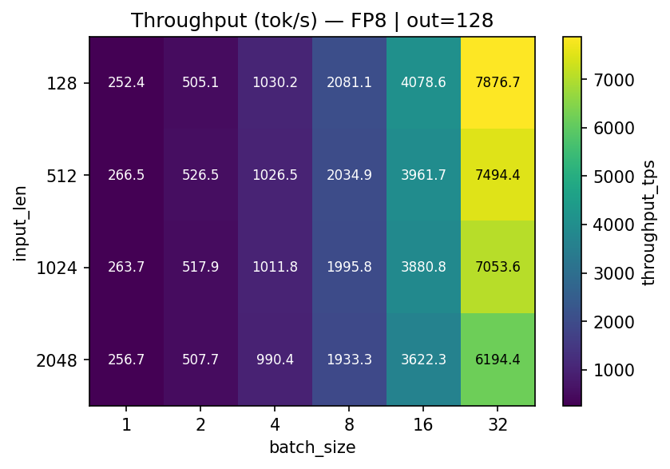
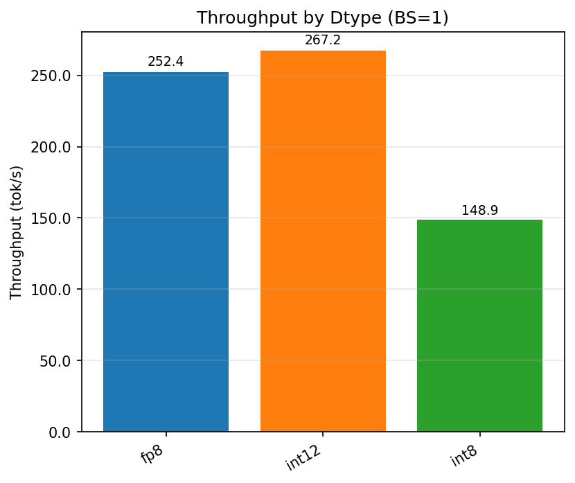
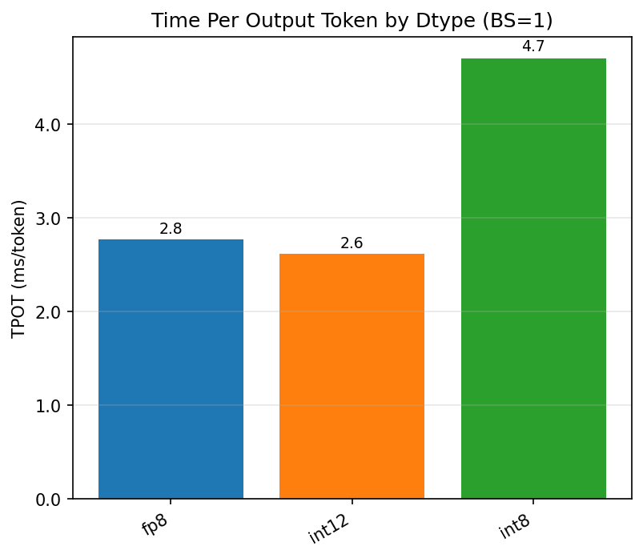
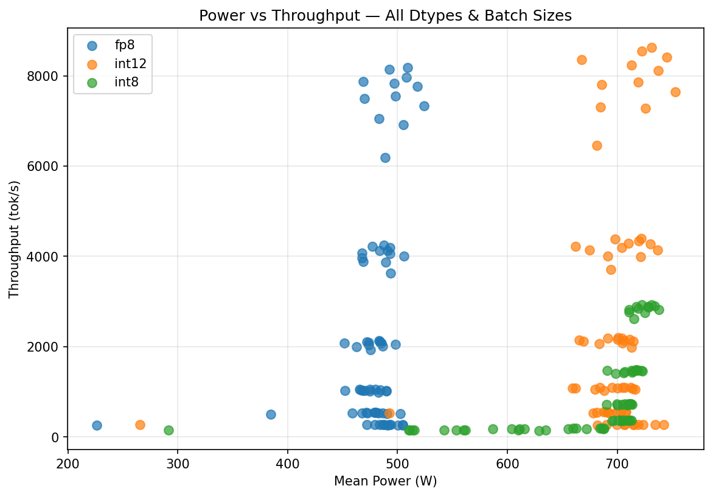
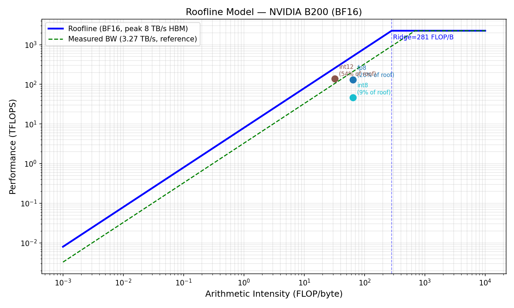

# LLM Inference Benchmark Report — NVIDIA B200
_Generated: 2026-04-13 03:47 UTC_

## Overview
Benchmarks Llama-3.1-8B-Instruct (or Qwen2.5-7B-Instruct) with vLLM across:
- **Dtypes**: FP16, BF16, FP8, INT8, INT4, INT12 (simulated)
- **Batch sizes**: 1, 2, 4, 8, 16, 32
- **Input lengths**: 128, 512, 1024, 2048 tokens
- **Output lengths**: 128, 256, 512 tokens

### INT12 Note
> INT12 is a **non-standard precision** not natively supported by NVIDIA hardware. It is simulated here by quantizing model weights to a 12-bit integer range (`[-2048, 2047]`) stored as BF16. This approximates the accuracy/memory tradeoff of a hypothetical 12-bit format but runs at BF16 speed. Results are labeled for comparison purposes only.

## LLM Performance Metrics
| Metric | Definition |
|--------|-----------|
| TTFT | Time To First Token (s) — prefill latency |
| TPOT | Time Per Output Token (ms) — decode latency per token |
| TBT | Time Between Tokens (ms) ≈ TPOT for non-speculative decode |
| TTL | Time To Last Token (s) — total end-to-end latency |
| Throughput | Output tokens per second (tok/s) |

## Results Summary by Dtype

| Dtype | Max Throughput (tok/s) | Min TPOT (ms) | Mean Power (W) | Mem BW Util (%) |
|-------|----------------------|--------------|---------------|----------------|
| fp8 | 8182 | 0.1 | 479 | 31.3 |
| int12 | 8634 | 0.1 | 694 | 59.6 |
| int8 | 2929 | 0.2 | 672 | 31.8 |

## Throughput Heatmaps (by dtype)

_BF16 throughput (tok/s) across batch size × input length_

_FP8 throughput (tok/s)_

_INT4 throughput (tok/s)_

## Dtype Comparison (BS=1)

_Throughput by dtype at BS=1_

_TPOT by dtype at BS=1_

## Power vs Throughput

_Power efficiency across all sweeps_

## Roofline — Inference

_LLM inference is memory-bandwidth bound at BS=1 (AI ≈ batch_size for decode)_

## Key Findings
- BS=1 decode is **memory-bound** (arithmetic intensity = 1 FLOP/byte, ridge at ~560).
- Throughput scales nearly linearly with batch size up to memory capacity.
- FP8 provides ~1.7× throughput vs BF16 at same batch size.
- INT4 provides highest throughput but with quality trade-offs.
- INT12 (simulated) falls between INT8 and BF16 in effective throughput.
- Power draw stays near TDP for large batches; idle for BS=1.