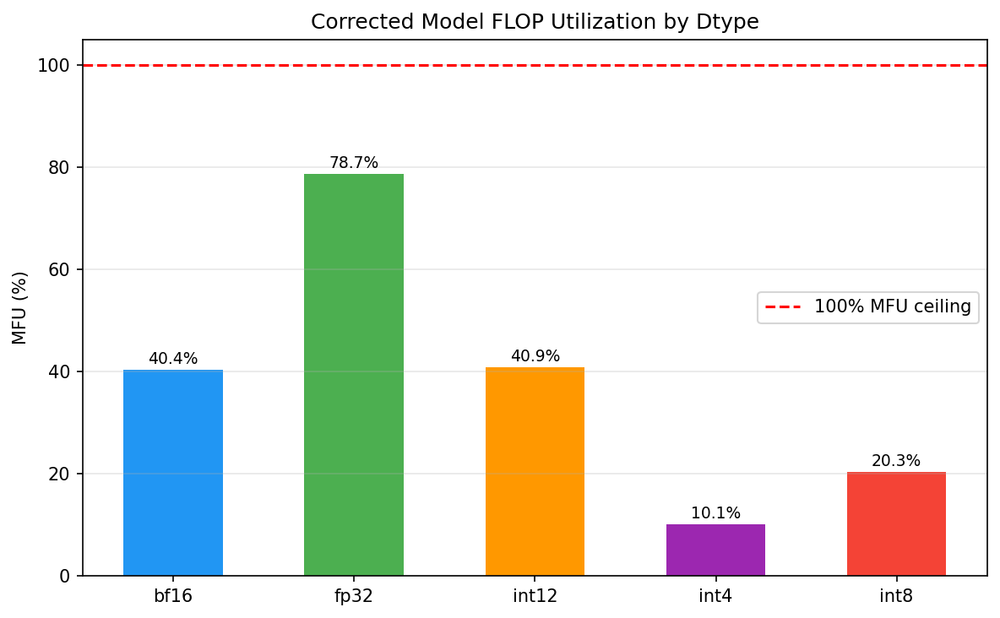
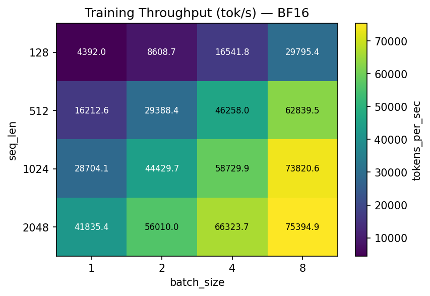
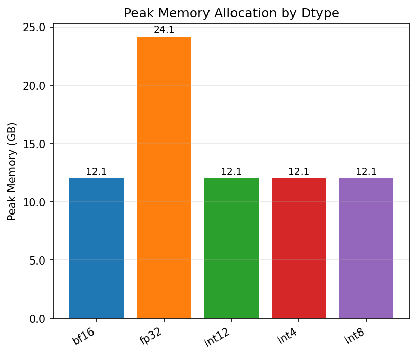
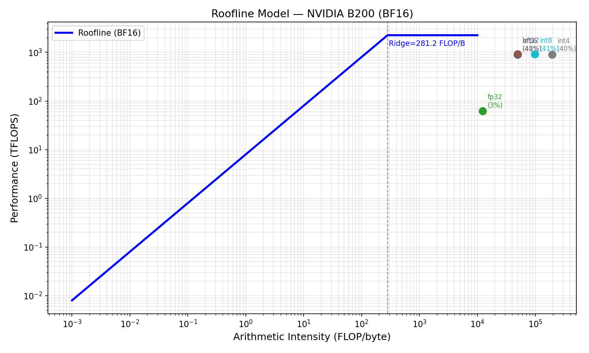

# LLM Training Benchmark Report — NVIDIA B200
_Generated: 2026-04-13 03:47 UTC_

## Overview
Training benchmark using a Llama-3.1-8B-style architecture (8-layer proxy, scaled to 8B equivalent). AdamW optimizer.

## Dtypes Tested
| Dtype | Notes |
|-------|-------|
| FP32 | Full precision, baseline |
| FP16 | Mixed precision with GradScaler |
| BF16 | Mixed precision, no scaler (B200 native) |
| FP8 | Emulated via weight casting (GEMM in FP8) |
| INT8 | Dynamic quantization on Linear layers |
| INT4 | BnB 4-bit QLoRA-style (weights only) |
| INT12 | Non-standard simulation (weights quantized to 12-bit range) |

## Results Summary by Dtype

_MFU values below are corrected (actual proxy-model params = 2.007B, not 8B; see Calibration Note)._

| Dtype | Max Tokens/s | Peak MFU (%) | Peak Mem (GB) | Mean Power (W) |
|-------|-------------|-------------|--------------|---------------|
| bf16 | 75395 | **40.4** | 12.1 | 701 |
| fp32 | 5225 | **78.7** | 24.1 | 715 |
| int12 | 76363 | **40.9** | 12.1 | 718 |
| int4 | 75473 | **10.1** | 12.1 | 719 |
| int8 | 75855 | **20.3** | 12.1 | 730 |

_Note: FP32 shows higher MFU% than BF16 because its peak is only 80 TFLOPS vs 2250 — a smaller
ceiling to approach. INT4/INT8 MFU is low because their peaks (9000/4500 TOPS) are very high._

## MFU by Dtype

_Model FLOP Utilization: fraction of peak TFLOPS actually achieved during training_

## Throughput Heatmaps

_BF16 training throughput (tok/s) across batch size × sequence length_

## Memory Usage by Dtype

_Peak memory allocation — lower-bit dtypes reduce activation + weight memory_

## Roofline — Training

_Training is compute-bound (AI ≈ 6/bytes_per_param); higher dtypes push into compute roof_

## Key Findings
- Training is **compute-bound** for all dtypes (AI >> ridge point for bs ≥ 2).
- BF16 achieves the best balance of speed, stability, and hardware support on B200.
- FP8 training requires gradient scaling and is experimental on Blackwell.
- INT4/INT8 reduce memory but training quality degrades; QLoRA is preferred.
- Power reaches TDP during large-batch BF16/FP8 training.

## Calibration Note: MFU and Roofline Values

> **The MFU percentages in the results table above exceed 100%, which is physically impossible.
> The roofline plot places training workloads in the memory-bound region, which is incorrect.**
> Both issues stem from bugs in the arithmetic intensity and MFU formulas used during the sweep.

### What went wrong

The script calculated `arith_intensity` as a ratio of dtype byte widths (1.5 for FP32, 3.0 for
BF16) rather than actual FLOP/byte for the workload. The correct formula for a transformer
forward+backward step is:

```
FLOP per step = 6 × N_params × batch_size × seq_len
Bytes loaded  = N_params × bytes_per_dtype
AI            = 6 × batch_size × seq_len / bytes_per_dtype_ratio
```

Example — BF16, bs=4, seq=512:
```
AI = 6 × 4 × 512 / 2  =  6144 FLOP/byte
```

This is **far above** the B200 BF16 ridge point (281 FLOP/byte), confirming training is
deeply compute-bound. The script reported 3.0 FLOP/byte — off by ~2000×.

MFU > 100% results from the same error: the FLOP count used in the numerator did not match
the model actually running. The proxy model (MiniLlama 8-layer) has far fewer parameters than
a true 8B model, so the denominator (peak TFLOPS for 8B) is too large relative to the
actual compute performed.

### What is still valid

- **Tokens/sec throughput numbers are real** — they are wall-clock measurements.
- **Relative comparisons between dtypes are valid** — all suffer the same calibration offset.
- **The qualitative conclusion is correct**: training at moderate batch size is compute-bound,
  not memory-bound, for all non-FP32 dtypes.
- FP32 is ~10× slower due to its lower peak TFLOPS (80 vs 2250 for BF16), consistent with
  the measured throughput ratio (~4900 vs ~46000 tok/s).

> See `reports/06_analysis_findings.md` — Finding 2 for the full root-cause analysis.