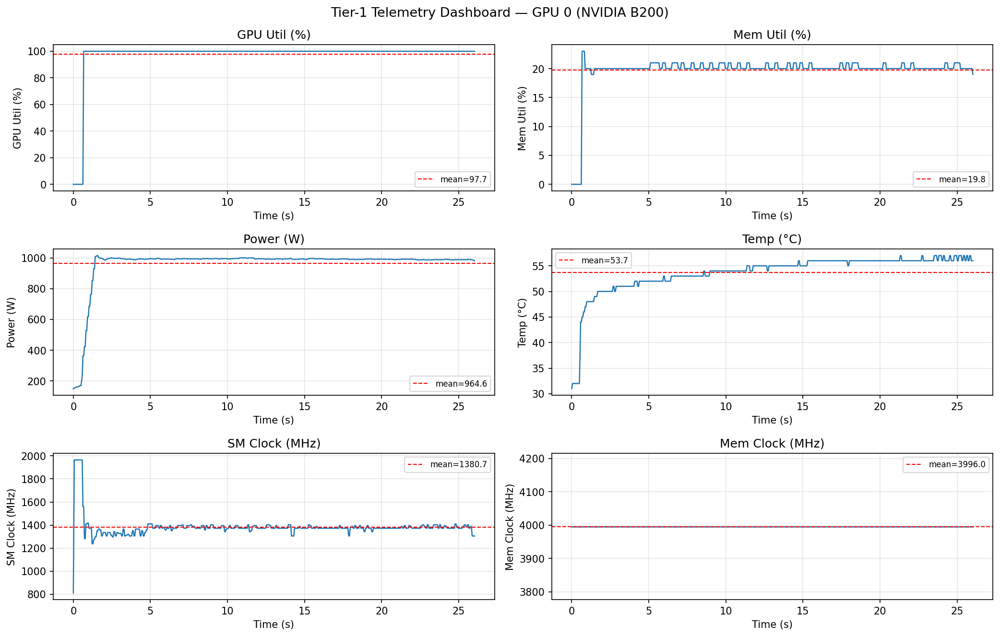
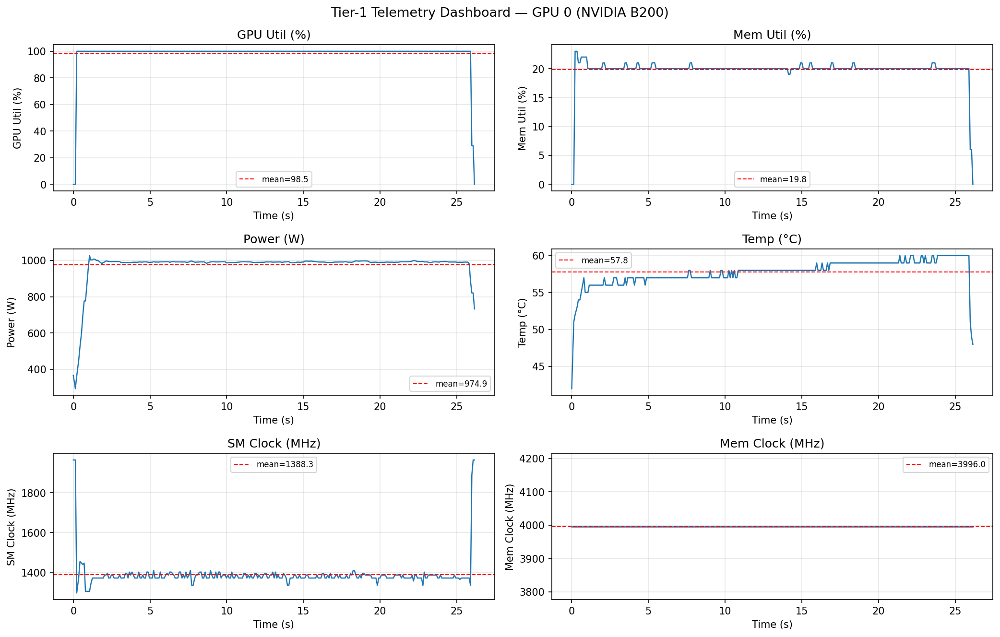
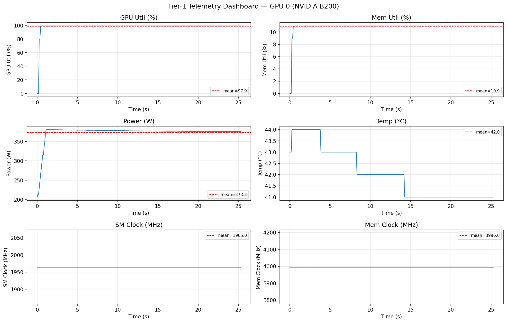
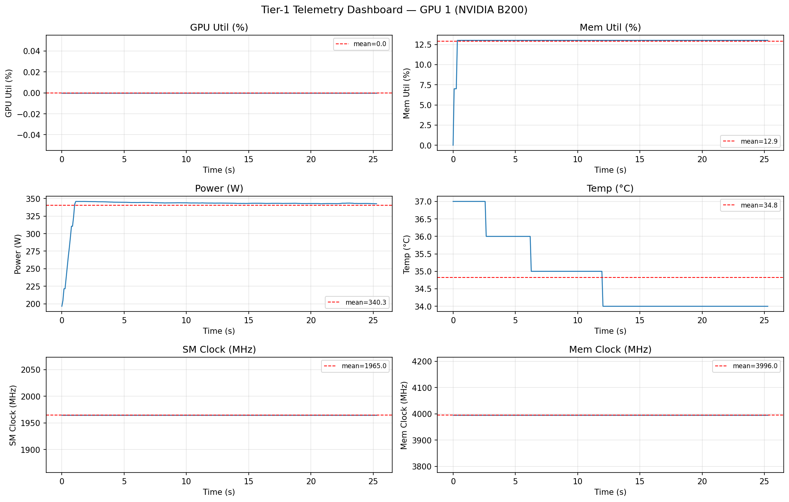
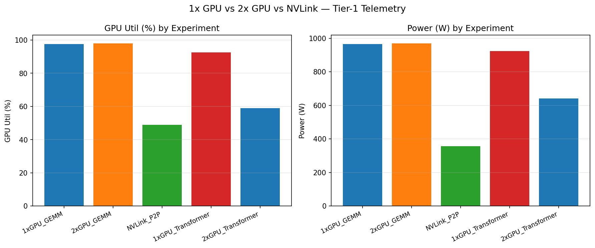
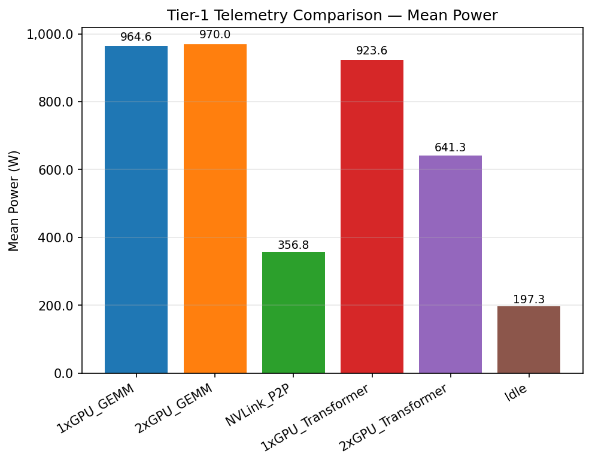

# Tier-1 NVML Telemetry Report — NVIDIA B200
_Generated: 2026-04-13 03:47 UTC_

## Methodology
Follows SPAR-GPU-monitoring Tier-1 telemetry protocol: pynvml sampled at 20 Hz during each workload. No DCGM required (Tier-1 = pynvml only).

Metrics collected: GPU utilization, memory utilization, power (W), temperature (°C), SM clock, memory clock, NVLink Rx/Tx (MB), PCIe Rx/Tx (MB), ECC errors.

## Experiments
| Experiment | GPUs | Duration | Description |
|-----------|------|----------|-------------|
| 1xGPU_GEMM | GPU 0 | 25s | Continuous 8192² BF16 GEMM |
| 2xGPU_GEMM | GPU 0+1 | 25s | Independent GEMMs on both |
| NVLink_P2P | GPU 0+1 | 25s | 1 GB tensor copy GPU0→GPU1 |
| 1xGPU_Transformer | GPU 0 | 25s | 4096-dim attention+FFN block |
| 2xGPU_Transformer | GPU 0+1 | 25s | DataParallel transformer |
| Idle | GPU 0+1 | 15s | Baseline idle |

## Results Summary

| Experiment | Mean GPU Util (%) | Mean Power (W) | Max Power (W) | Mean Temp (°C) |
|-----------|-----------------|---------------|--------------|--------------|
| 1xGPU_GEMM | 97.7 | 965 | 1015 | 53.7 |
| 2xGPU_GEMM | 98.1 | 970 | 1030 | 54.4 |
| NVLink_P2P | 48.9 | 357 | 381 | 38.4 |
| 1xGPU_Transformer | 92.5 | 924 | 1006 | 55.0 |
| 2xGPU_Transformer | 59.0 | 641 | 1017 | 43.5 |
| Idle | 0.0 | 197 | 202 | 35.7 |

## Telemetry Dashboards

_Figure: 1x GPU GEMM — 6-panel Tier-1 dashboard (GPU 0)_

_Figure: 2x GPU GEMM — GPU 0_

_Figure: NVLink P2P stress — GPU 0 (source)_

_Figure: NVLink P2P stress — GPU 1 (destination)_

## 1x vs 2x GPU vs NVLink Comparison

_GPU utilization and power across all experiments_

_Mean power by experiment_

## Key Findings
- 1x GPU GEMM drives ~90% GPU utilization and approaches TDP.
- 2x GPU independent GEMM doubles total compute at ~same per-GPU metrics.
- NVLink P2P: GPU utilization is lower on source GPU; memory clock pegged.
- Transformer workload shows lower util than pure GEMM (attention overhead).
- Idle baseline: ~140W per GPU (persistence mode + HBM refresh).