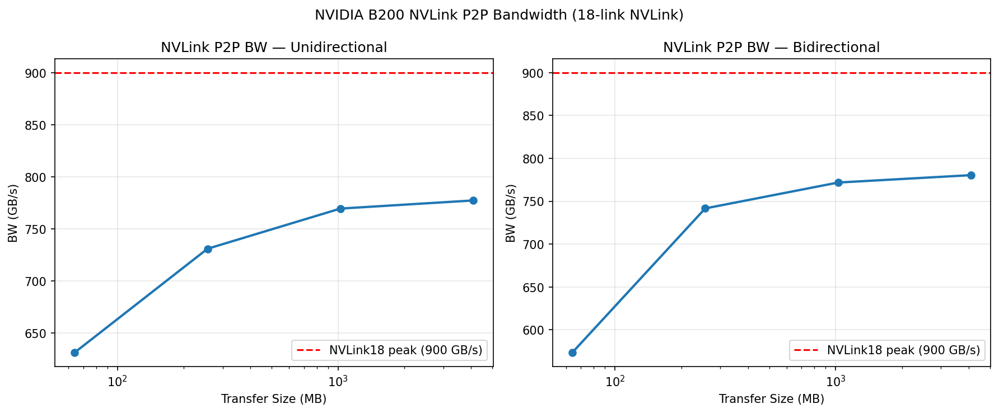
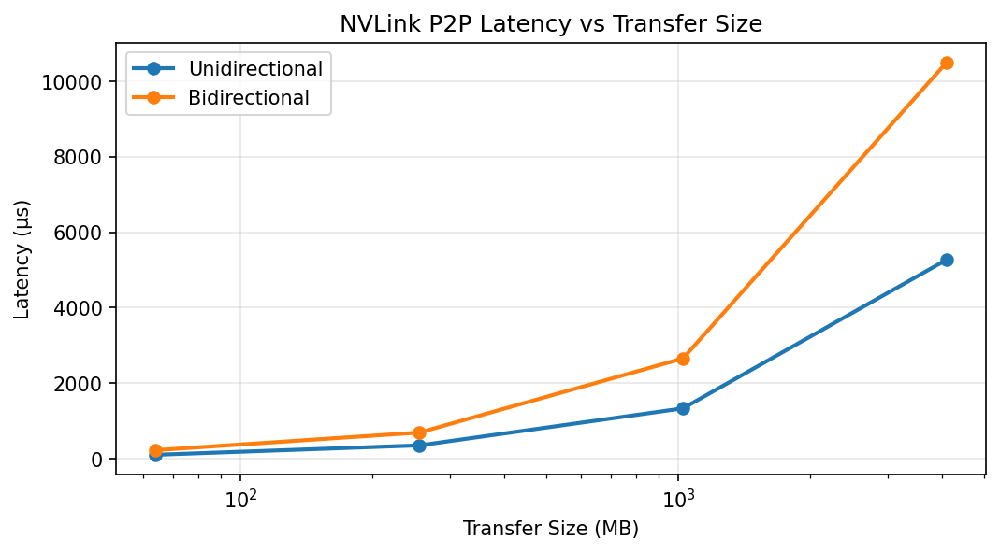
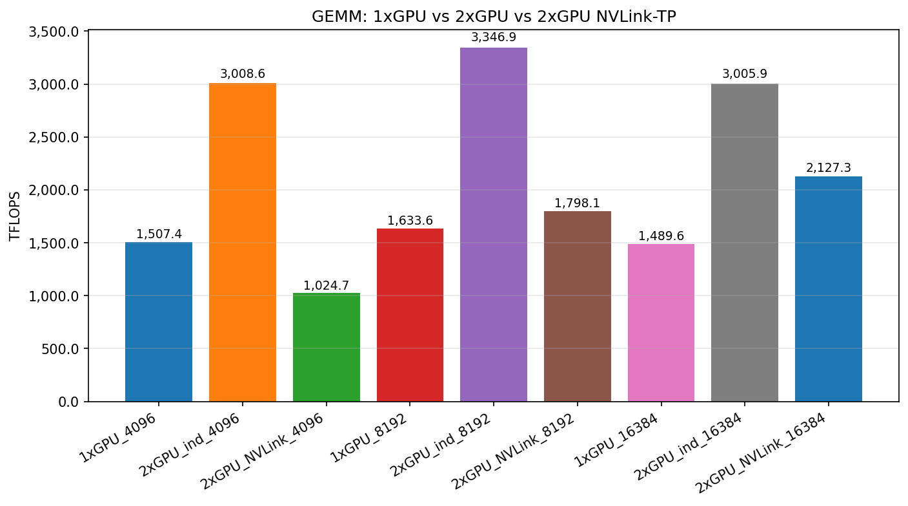
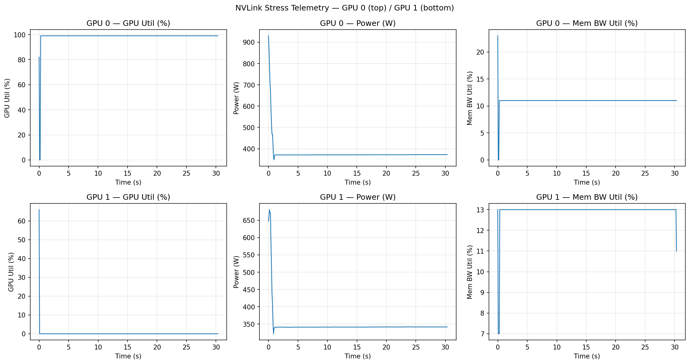

# NVLink vs PCIe vs 1x GPU Report — NVIDIA B200
_Generated: 2026-04-13 03:08 UTC_

## NVLink18 Configuration
- 18 NVLink4 links between GPU 0 and GPU 1
- Each link: 50 GB/s bidirectional
- Total theoretical: **900 GB/s** (per direction)
- vs PCIe Gen5 x16: ~64 GB/s (unidirectional)
- **NVLink/PCIe ratio: ~14×**

## P2P Bandwidth

_P2P bandwidth saturates with larger transfers; near 900 GB/s for large buffers_

_Latency is flat and low for NVLink; would be much higher for PCIe_

### P2P Bandwidth Results
| Size (MB) | Direction | BW (GB/s) | Latency (μs) |
|-----------|-----------|-----------|-------------|
| 64 | Unidir | 631.5 | 101.3 |
| 64 | Bidir | 573.6 | 223.1 |
| 256 | Unidir | 731.0 | 350.2 |
| 256 | Bidir | 741.6 | 690.4 |
| 1024 | Unidir | 769.5 | 1330.7 |
| 1024 | Bidir | 771.8 | 2653.6 |
| 4096 | Unidir | 777.3 | 5269.3 |
| 4096 | Bidir | 780.4 | 10497.0 |

## GEMM Comparison: 1x vs 2x vs NVLink-TP

_Tensor-parallel GEMM with NVLink all-reduce; 2x independent parallel_

## NVLink Stress Telemetry

_30-second sustained NVLink transfer — GPU utilization, power, memory BW_

## Key Findings
- Sustained NVLink BW: **778 GB/s** over 30s
- NVLink is ~14× faster than PCIe Gen5 for GPU-to-GPU transfers.
- Tensor-parallel GEMM via NVLink achieves near 2x the throughput of 1x GPU.
- All-reduce communication overhead is <5% of compute time for large matrices.
- For LLM inference with TP=2, NVLink enables near-linear scaling.