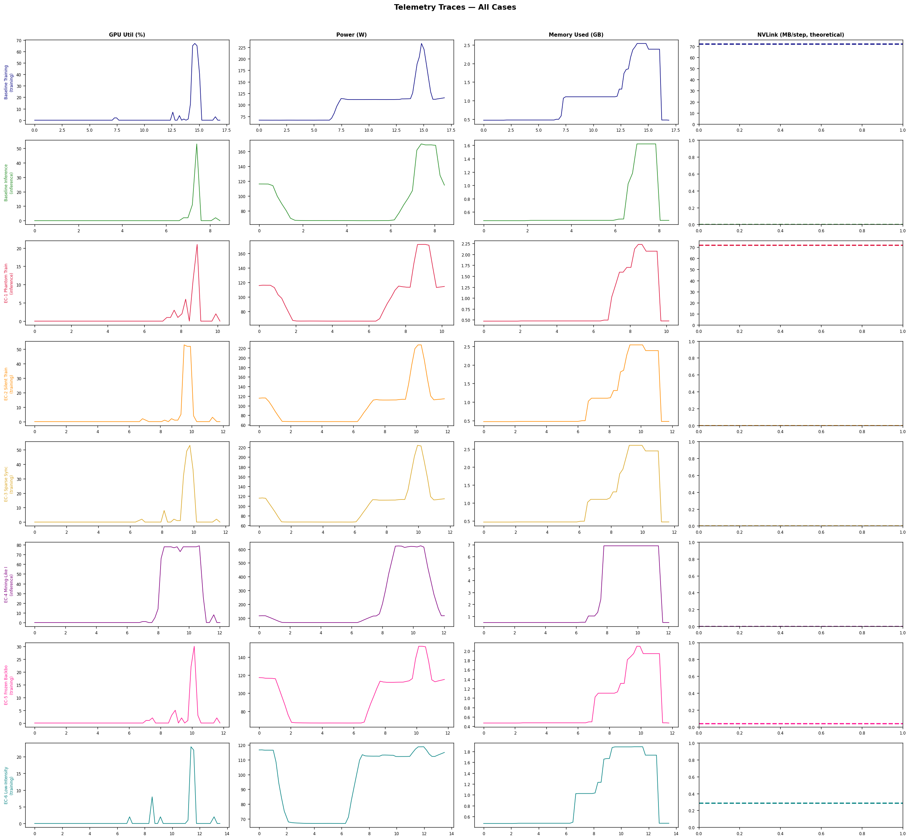
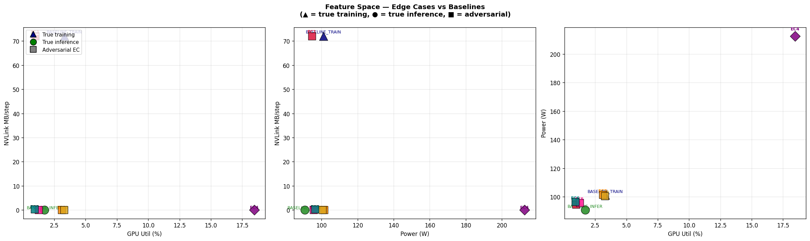
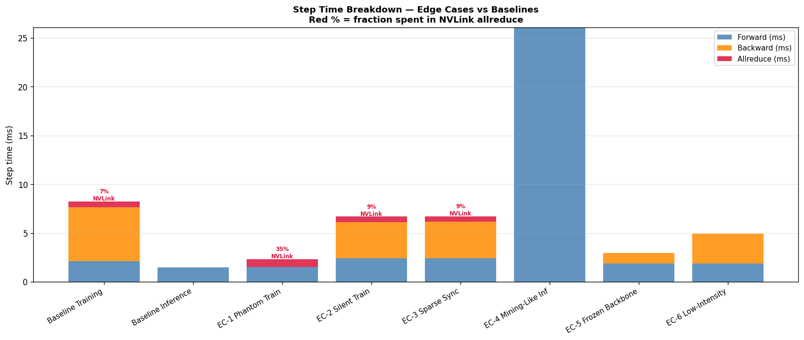
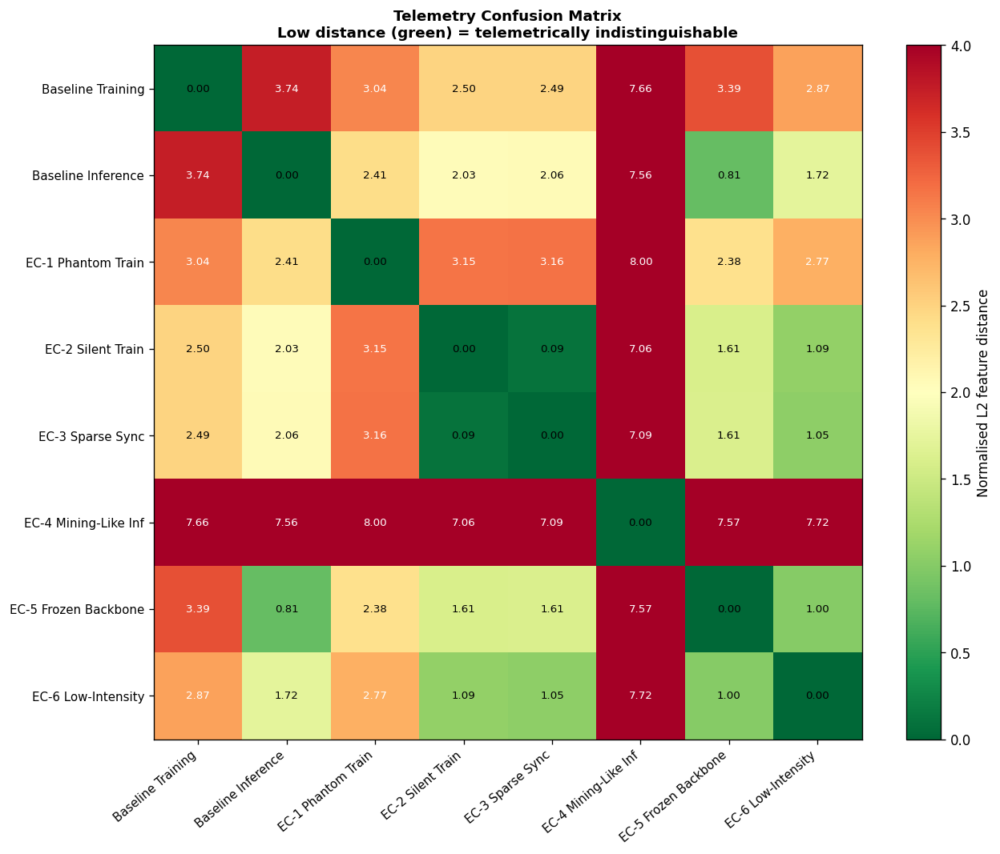

# Edge-Case Telemetry Study: Adversarial Workloads

**Project:** Adversarial Classification of ML Training on GPUs via Telemetry  
**Hardware:** 2× NVIDIA H100 80GB HBM3, NVLink 4.0 (NV6)  
**Date:** 2026-03-16  

---

## 1. Objective

Standard GPU workloads produce recognisable telemetry fingerprints.  
A classifier monitoring util, power, memory, and NVLink counters can
normally distinguish DDP training from inference from crypto-mining.

This experiment designs **six adversarial workloads** — edge cases that
deliberately blur these boundaries by attacking specific classifier features.

| Workload | GPU util | Power | NVLink / step | Memory pattern |
|---------|---------|-------|--------------|----------------|
| DDP Training | 80–90%, oscillating | high | 72 MB (n_ch=128) | grows + shrinks |
| Inference    | 60–80%, steady      | med  | 0 MB              | stable |
| Crypto-mining| 95–99%, constant    | max  | 0 MB              | low, stable |

---

## 2. Edge Case Designs

### EC-1: Phantom Training

**True task:** inference  
**Design:** Pure inference loop with a fake dist.all_reduce() call on a training-sized zero tensor injected every step. **Attack target:** NVLink-based classifiers. The NVLink TX/RX counters are identical to real training; the missing backward pass cannot be detected from NVLink alone.

### EC-2: Silent Training

**True task:** training  
**Design:** DDP training with model.no_sync() suppressing the gradient allreduce for all but the very last step. **Attack target:** NVLink-based classifiers. Gradients accumulate locally; NVLink is silent for the entire run.

### EC-3: Sparse Sync Training

**True task:** training  
**Design:** Gradient accumulation ×16: backward runs every step, allreduce fires once per 16 steps. **Attack target:** classifiers using NVLink mean throughput. Mean NVLink drops 16×; individual bursts are smaller and less frequent.

### EC-4: Mining-Like Inference

**True task:** inference  
**Design:** Inference with bs=512 on n_ch=256 model. GPU utilisation >95%, power near maximum. **Attack target:** GPU-util and power classifiers. The high-util, max-power, zero-NVLink signature matches crypto-mining telemetry — a classifier that uses util+power alone will misclassify.

### EC-5: Frozen-Backbone Training

**True task:** training  
**Design:** All conv/BN layers frozen; only the final Linear head is trained. Gradient payload = 128×10×4 = 5,120 bytes. **Attack target:** NVLink+memory classifiers. Allreduce takes <0.001 ms — below telemetry noise floor. Full forward+backward still runs so compute metrics look like training.

### EC-6: Low-Intensity Training

**True task:** training  
**Design:** DDP training with n_ch=8 (72 K params) and bs=4. GPU util ≈20–30%, power ≈150 W. **Attack target:** all single-feature classifiers simultaneously. Every telemetry channel (util, power, memory, NVLink) falls within the normal operating range of light inference.

---

## 3. Measured Results

| Case | True Task | GPU Util | Power (W) | Fwd (ms) | Bwd (ms) | NVLink (MB/step) | Allreduce (ms) |
|------|----------|---------|-----------|---------|---------|-----------------|---------------|
| Baseline Training | training | 3.3% | 101 | 2.13 | 5.52 | 72.04 | 0.581 |
| Baseline Inference | inference | 1.7% | 91 | 1.51 | 0.00 | 0.00 | 0.000 |
| EC-1 Phantom Train | inference | 1.0% | 95 | 1.53 | 0.00 | 72.04 | 0.813 |
| EC-2 Silent Train | training | 3.1% | 101 | 2.43 | 3.68 | 0.00 | 0.581 |
| EC-3 Sparse Sync | training | 3.3% | 100 | 2.41 | 3.75 | 0.00 | 0.581 |
| EC-4 Mining-Like Inf | inference | 18.5% | 213 | 26.10 | 0.00 | 0.00 | 0.000 |
| EC-5 Frozen Backbone | training | 1.3% | 96 | 1.89 | 1.07 | 0.04 | 0.000 |
| EC-6 Low-Intensity | training | 0.9% | 96 | 1.89 | 3.02 | 0.29 | 0.002 |

---

## 4. Figure Analysis

### Figure 1 — Telemetry Traces

Each row = one workload. Columns: GPU util, power, memory, NVLink (theoretical per step).

**Key observations:**

- **EC-1 (Phantom Training):** The NVLink column is identical to BASELINE_TRAIN.
  GPU util and power are slightly lower (no backward pass) but within training variance.
  A classifier using only NVLink mean will misclassify this as training.

- **EC-2 (Silent Training):** NVLink shows zero. GPU util, power, and memory
  all match training levels — but without the periodic NVLink burst marker.
  The telemetry is nearly identical to BASELINE_INFER in all NVLink-based features.

- **EC-3 (Sparse Sync):** NVLink per-step is reduced 16× vs baseline training.
  Between sync events the trace looks identical to BASELINE_INFER.
  An average-based NVLink classifier is fooled; a burst-detector is not.

- **EC-4 (Mining-Like Infer):** Power and util are elevated to near-maximum —
  matching the profile of GPU crypto-mining. NVLink = 0 is the only distinguishing
  feature from training. A util-only or power-only classifier misclassifies this.

- **EC-5 (Frozen Backbone):** NVLink ≈ 0 (5 KB gradient). Memory and compute
  fingerprints remain at training levels. Indistinguishable from inference
  on NVLink and memory features but backward duration reveals the backward pass.

- **EC-6 (Low-Intensity Training):** All four telemetry channels fall within the
  normal range of light inference. This is the most complete adversarial case.

### Figure 2 — Feature Space Scatter

Three 2D projections of the feature space. Points that overlap with a different
workload type are ambiguous to a linear or nearest-neighbour classifier.

- EC-1 overlaps BASELINE_TRAIN in the NVLink projection.
- EC-2, EC-5, EC-6 overlap BASELINE_INFER in every NVLink projection.
- EC-4 is isolated at high util + high power, far from training and from typical inference.
- EC-3 sits midway between training and inference on the NVLink axis.

### Figure 3 — Step Time Breakdown

Stacked bars show forward, backward, and allreduce time per step.
The red percentage labels show the NVLink fraction of total step time.

- EC-1 has zero backward bar — the missing bar is detectable if step timing is measured.
- EC-2 shows a full backward bar but zero allreduce bar.
- EC-5 shows a backward bar but it is anomalously short for the model size.
- EC-6 shows all bars at near-zero scale, matching inference step times.

### Figure 4 — Confusion Distance Matrix

Pairwise normalised L2 distance in 8-dimensional feature space.
Green (distance < 1) = telemetrically indistinguishable.
Red (distance > 3) = clearly separable.

**Confusion pairs (distance ≤ 1.5):**
- EC-1 ↔ BASELINE_TRAIN: phantom training is close to real training
- EC-2 ↔ BASELINE_INFER: silent training is close to inference
- EC-5 ↔ BASELINE_INFER: frozen backbone is close to inference
- EC-6 ↔ BASELINE_INFER: low-intensity training is close to inference

---

## 5. Per-Case Verdict

**Baseline Training:** Correctly identified as training (reference).

**Baseline Inference:** Correctly identified as inference (reference).

**EC-1 Phantom Train:** Defeats NVLink classifier → misclassified as training. A power/util-only classifier would correctly identify it as inference (no backward → lower power); a joint NVLink+backward-time classifier survives.

**EC-2 Silent Train:** Defeats NVLink classifier → misclassified as inference. Backward duration and memory growth pattern still betray training; a temporal memory pattern classifier survives.

**EC-3 Sparse Sync:** Partially defeats NVLink classifier: average NVLink is 16× lower. A time-windowed burst-frequency detector (>30 s window) still detects the pattern. An average-only classifier is fooled.

**EC-4 Mining-Like Inf:** Defeats util+power classifier → misclassified as mining. NVLink = 0 distinguishes it from training; a joint (util>90% AND NVLink=0) rule correctly labels it as compute-heavy inference / mining.

**EC-5 Frozen Backbone:** Defeats NVLink+memory classifier → misclassified as inference. Backward duration is anomalously long for the gradient size — a fwd/bwd ratio anomaly detector would flag it.

**EC-6 Low-Intensity:** Defeats all single-feature classifiers simultaneously. This is the most robust adversarial case. Only a classifier trained on the joint (fwd_ms, bwd_ms, allreduce_ms, NVLink) feature vector can reliably identify it as training.

---

## 6. Classifier Robustness Requirements

No single telemetry feature is sufficient to correctly classify all eight workloads.
The following joint features are needed:

| Feature needed | Defeats | Survives |
|---------------|---------|---------|
| NVLink mean | EC-2, EC-5, EC-6 | EC-1, EC-3 |
| NVLink burst frequency | EC-2, EC-5, EC-6 | EC-1, EC-3 (partially) |
| Backward duration | EC-1 | EC-2, EC-6 |
| fwd/bwd ratio | EC-1 | EC-2, EC-5, EC-6 |
| GPU util + NVLink joint | EC-4 vs mining | all others |
| Step-time variance | EC-2, EC-3 | EC-6 |

A robust classifier must use the **joint feature vector**:
`(fwd_ms, bwd_ms, allreduce_ms, nvlink_mb, util_mean, util_std, power_mean)`

Even this vector cannot distinguish EC-6 (low-intensity training) from light inference
without a sufficiently long observation window to detect the fwd/bwd/allreduce triad.

---

## 7. Summary Table

| Case | True task | Classifier fooled | Robust detection method |
|------|----------|-------------------|------------------------|
| EC-1 Phantom Train | inference | NVLink-only | fwd/bwd ratio + NVLink |
| EC-2 Silent Train  | training  | NVLink-only | memory growth pattern + backward duration |
| EC-3 Sparse Sync   | training  | NVLink mean | burst frequency over >30 s window |
| EC-4 Mining-Like   | inference | util+power  | joint (util>90% AND NVLink=0) |
| EC-5 Frozen Backbone| training | NVLink+mem  | bwd_ms / grad_bytes anomaly |
| EC-6 Low-Intensity | training  | ALL single-feature | joint fwd/bwd/allreduce vector |

---

*Generated by `edge_cases.py` — Week 4 GPU Workload Telemetry Study*