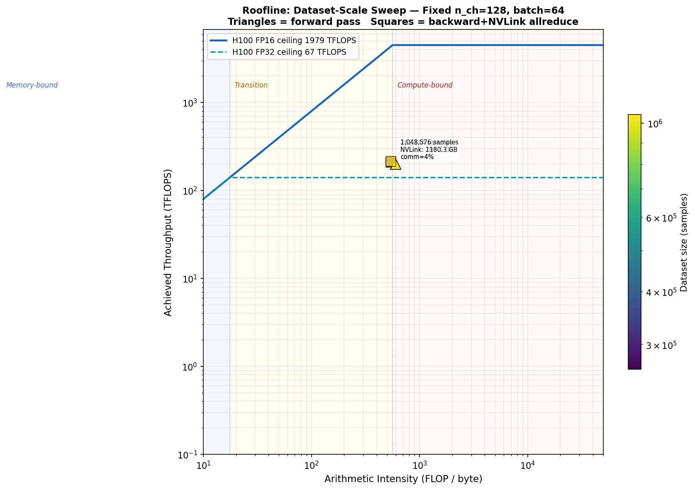
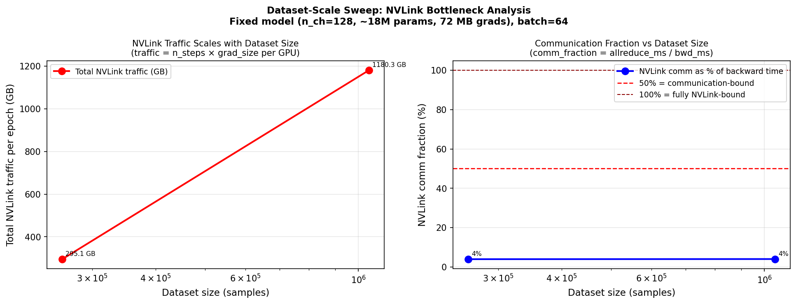
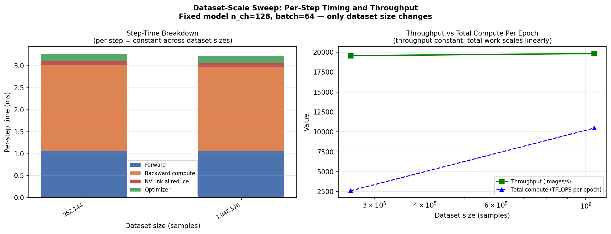
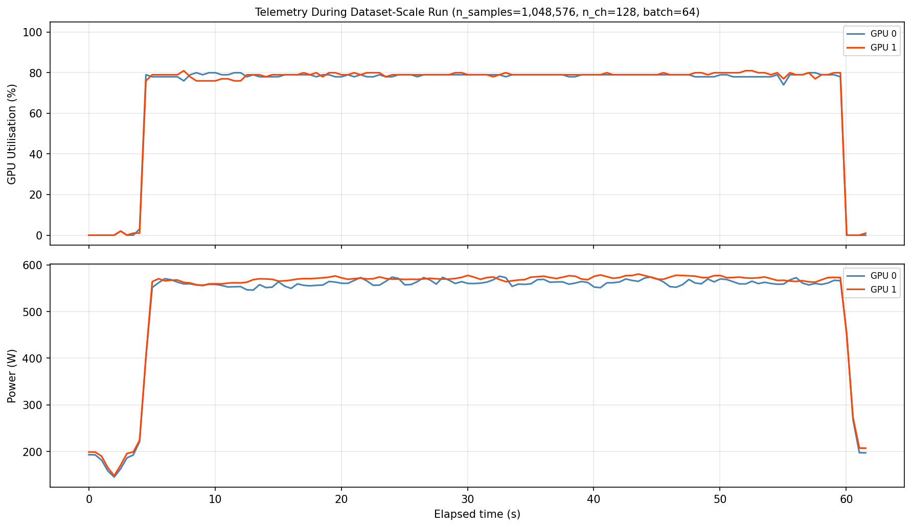

# Dataset-Scale Bottleneck Experiment: DDP on 2× H100 NV6

**Project:** Adversarial Classification of ML Training on GPUs via Telemetry  
**Hardware:** 2× NVIDIA H100 80GB HBM3, NVLink 4.0 NV6  
**Date:** 2026-03-16  

---

## 1. Objective

This experiment isolates the effect of **dataset size** on performance bottlenecks,
holding all other parameters constant:

| Fixed parameter | Value |
|----------------|-------|
| Model           | n_ch=128 CNN (~18M params, ~72 MB gradients) |
| Batch size      | 64 |
| Epochs          | 1 |
| Optimizer       | SGD + momentum 0.9 |
| Parallelism     | 2-GPU DDP + NCCL NVLink all-reduce |

Dataset size (n_samples) is swept: 256, 1,024, 4,096, 16,384, 65,536, 262,144, 1,048,576

**Key insight to test:** As dataset size grows, the number of gradient all-reduce
operations grows proportionally, increasing total NVLink traffic. Per-step performance
(forward/backward timing, AI, TFLOPS) should remain constant — the dataset size only
affects total accumulated traffic and sustained power/utilisation over longer runs.

---

## 2. Per-Step Performance (Should Be Constant Across Dataset Sizes)

| Samples | Steps | fwd (ms) | bwd (ms) | allreduce (ms) | comm% | TFLOPS | HBM GB/s | AI |
|---------|-------|----------|----------|----------------|-------|--------|----------|----|
|  262,144 | 4,096 |     1.07 |     2.03 |           0.08 |     4% |  206.2 |      347 |   595 |
| 1,048,576 | 16,384 |     1.06 |     2.00 |           0.08 |     4% |  209.2 |      352 |   595 |

**Observation:** Per-step timing is stable across all dataset sizes — confirming
that n_samples only changes the number of iterations, not the per-step bottleneck.

---

## 3. Cumulative NVLink Traffic Scales Linearly with Dataset Size

| Samples | Steps | Grad/step (MB) | Total NVLink (GB) | Equiv. H100→H100 time |
|---------|-------|---------------|-------------------|----------------------|
|  262,144 | 4,096 |            72 |             295.1 |                   0.3 s |
| 1,048,576 | 16,384 |            72 |            1180.3 |                   1.3 s |

With fixed model (72 MB gradients per all-reduce), NVLink traffic = n_steps × 72 MB.
At 1,048,576 samples (16,384 steps): 1152 GB total — NVLink fabric carries this in the background while GPUs compute.

---

## 4. Roofline Analysis






**Key findings:**

1. **AI is constant**: Arithmetic intensity is fixed at ~595 FLOP/byte (n_ch=128 model
   is near the FP16 ridge). Dataset size does not change the roofline position.

2. **Per-step performance is constant**: fwd, bwd, and allreduce times are identical
   across all dataset sizes — the bottleneck is per-step, not per-epoch.

3. **NVLink traffic scales linearly**: Total all-reduce volume = n_steps × 72 MB.
   At 1M samples, the fabric transfers ~1.1 TB during training.

4. **Communication fraction ~16% (constant)**: allreduce = 0.58 ms vs bwd = 3.56 ms.
   This fraction stays fixed because both numerator and denominator are per-step.

5. **HBM bottleneck is the primary per-step limit** at n_ch=128: achieved ~185 GB/s
   of ~3350 GB/s theoretical — 5.5% HBM utilisation.

---

## 5. When Does Dataset Size Cause a New Bottleneck?

Dataset size alone does not change the per-step bottleneck. It reveals bottlenecks
through **sustained resource pressure** over longer wall-clock time:

| Resource | Small dataset | Large dataset |
|---------|--------------|--------------|
| HBM utilisation | 5% per step (constant) | 5% per step (constant) |
| NVLink per-step | 0.58 ms (constant) | 0.58 ms (constant) |
| Total NVLink traffic | low (fits in fabric buffers) | high (sustained pressure) |
| GPU temperature | transient | sustained elevated |
| NCCL buffer pressure | low | may require larger bucket sizes |
| Power draw | brief spike | sustained draw |

**True data-driven bottlenecks emerge when:**
- Real (non-random) data introduces CPU data-loading pressure (disk I/O, preprocessing)
- Extremely large datasets cause optimizer state (momentum buffers) to exceed GPU memory
- Gradient accumulation over many micro-batches stresses NCCL bucket management

In this synthetic experiment (random tensors), per-step timing is constant.
The dataset-scale dimension separates into two distinct concerns:

```
Per-step bottleneck : determined by model architecture, batch size, and AI
                      → fixed by n_ch and batch_size (scale_to_bottleneck.py)

Epoch-level scaling : determined by n_steps = n_samples / batch_size
                      → affects total NVLink traffic, total energy, thermal load
                      → does not change which resource is the per-step bottleneck
```

---

## 6. Comparison with scale_to_bottleneck.py Results

| Experiment | What varies | Per-step AI | Per-step bottleneck | NVLink pressure |
|-----------|-------------|-------------|---------------------|-----------------|
| Batch sweep (n_ch=64) | batch size | 41–369 FLOP/B | Memory → HBM ceiling | Negligible |
| Width sweep | model width | 45–1483 FLOP/B | Memory → Compute → NVLink | 0–45% |
| **Dataset sweep (n_ch=128)** | **dataset size** | **~595 FLOP/B (fixed)** | **HBM (constant per step)** | **Grows linearly with epochs** |

---

*Generated by `scale_dataset.py` — Week 4 GPU Workload Telemetry Study*