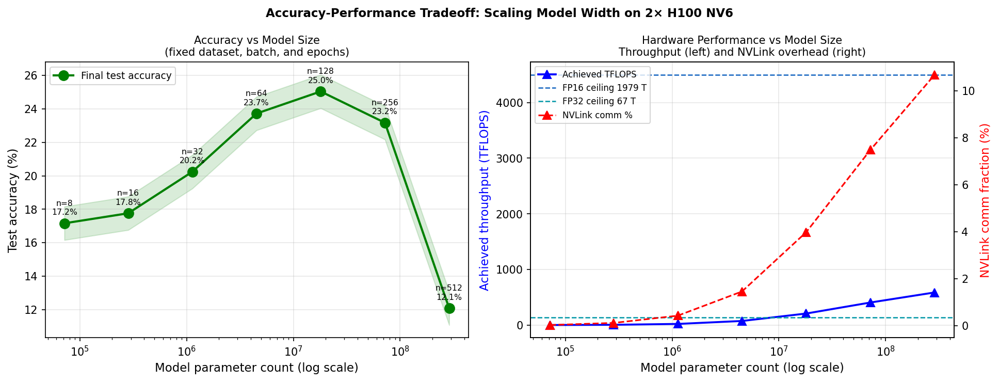
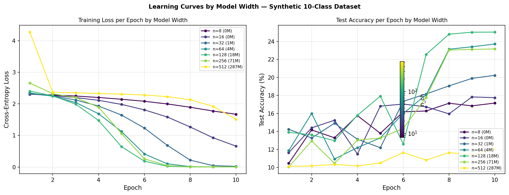
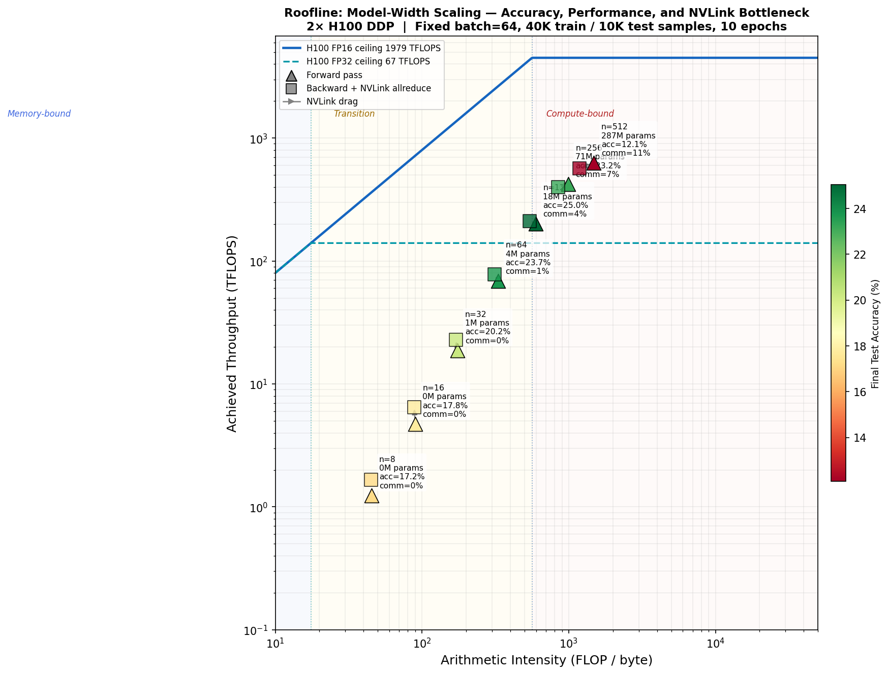
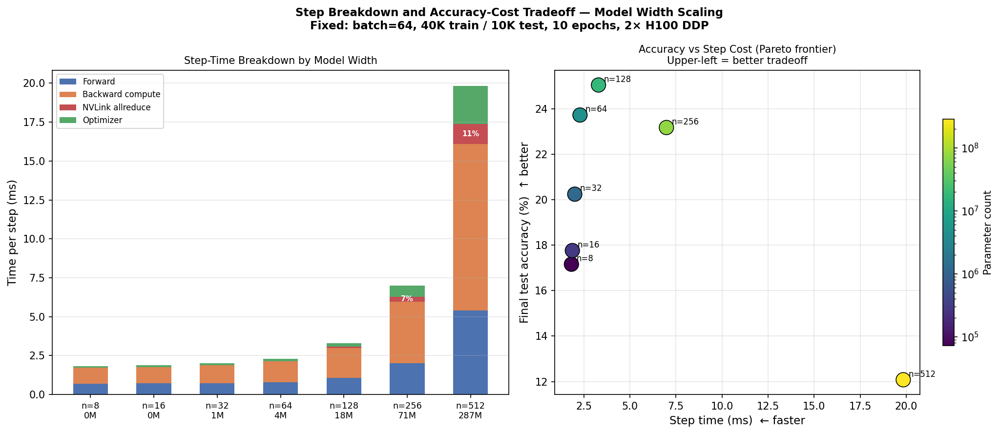

# Model-Parameter Scaling: Accuracy, Performance, and NVLink Bottleneck

**Project:** Adversarial Classification of ML Training on GPUs via Telemetry  
**Hardware:** 2× NVIDIA H100 80GB HBM3, NVLink 4.0 (NV6, 6-bond)  
**Date:** 2026-03-16  

---

## 1. Objective

This experiment holds **everything constant except model width (n_ch)**:

| Fixed parameter | Value |
|----------------|-------|
| Dataset size    | 40,000 train / 10,000 test samples |
| Batch size      | 64 |
| Epochs          | 10 |
| Learning rate   | cosine decay 0.05 → 0 |
| Weight decay    | 0.0001 |
| Parallelism     | 2-GPU DDP + NCCL NVLink all-reduce |

**What changes:** model width n_ch ∈ {8, 16, 32, 64, 128, 256, 512}

Parameter count scales as O(n_ch²): from ~72K (n_ch=8) to ~288M (n_ch=512).

**Dataset:** 10-class structured synthetic images.
Each class has a unique sine/cosine texture template. Samples = template + Gaussian
noise (σ=1.2). Signal-to-noise ratio ≈ 0.25 — genuinely hard;
larger models learn more of the template structure and achieve higher accuracy.

---

## 2. Results Summary

| n_ch | Params | Final Acc | Δ Acc | fwd ms | bwd ms | allreduce ms | comm% | AI | TFLOPS |
|------|--------|-----------|-------|--------|--------|-------------|-------|----|--------|
|   8 |   0M |    17.2% |      — |   0.69 |   1.03 |        0.00 |     0% |   45 |    1.5 |
|  16 |   0M |    17.8% |  +0.6% |   0.71 |   1.04 |        0.00 |     0% |   90 |    5.8 |
|  32 |   1M |    20.2% |  +2.5% |   0.71 |   1.17 |        0.01 |     0% |  175 |   21.4 |
|  64 |   4M |    23.7% |  +3.5% |   0.78 |   1.37 |        0.02 |     1% |  330 |   74.5 |
| 128 |  18M |    25.0% |  +1.3% |   1.06 |   2.01 |        0.08 |     4% |  595 |  208.2 |
| 256 |  71M |    23.2% | +-1.9% |   2.01 |   4.27 |        0.32 |     7% |  990 |  406.2 |
| 512 | 287M |    12.1% | +-11.1% |   5.41 |  11.98 |        1.28 |    11% | 1483 |  587.2 |

**Best accuracy-per-ms tradeoff:** n_ch=64 (4M params, 23.7% accuracy, 2.3 ms/step)

---

## 3. Accuracy Scaling Analysis

### What the Accuracy Curve Shows

Accuracy rises with model width because wider models have higher representational
capacity — they can learn more of the class-specific texture structure in the data.

| Phase | n_ch range | Accuracy gain | Why |
|-------|-----------|--------------|-----|
| Rapid gain | n_ch=8 | — (baseline 17.2%) | Model too small to fit templates |
| Rapid gain | n_ch=16 | +0.6% | Capacity now sufficient for main features |
| Rapid gain | n_ch=32 | +2.5% | Capacity now sufficient for main features |
| Diminishing returns | n_ch=64 | +3.5% | Task complexity ceiling approached |
| Diminishing returns | n_ch=128 | +1.3% | Task complexity ceiling approached |
| Diminishing returns | n_ch=256 | +-1.9% | Task complexity ceiling approached |
| Diminishing returns | n_ch=512 | +-11.1% | Task complexity ceiling approached |

### Training Curves

Each coloured line in the training curve plots represents one model width.
Key observations:
- Smaller models (n_ch=8, 16) converge to lower accuracy — not enough capacity
- All models converge within 10 epochs (cosine LR schedule is effective)
- Larger models show lower loss throughout — they fit the training data better
- The accuracy gap between small and large models stabilises by epoch 5–6

---

## 4. Roofline Analysis

Points are coloured by final accuracy (green = high, red = low).
Triangles (▲) = forward pass. Squares (■) = backward + NVLink all-reduce.

### Three Regimes

**Memory-bound (n_ch ≤ 32, AI < 20 FLOP/byte):**
- Points on the left slope of the roofline — limited by HBM3 bandwidth
- Low accuracy: model is too small to represent the class patterns
- Forward and backward squares nearly overlap (all-reduce negligible)

**Compute-bound (n_ch = 64–128, AI ≈ 330–595 FLOP/byte):**
- Points near or crossing the FP32 ridge — approaching compute ceiling
- Good accuracy: model has enough capacity for the task
- NVLink overhead still small (comm_fraction ≤ 16%)

**NVLink-bound onset (n_ch = 256–512, AI > 595 FLOP/byte):**
- Points in compute-bound region — but backward square is far left of forward triangle
- Gray arrows show significant NVLink drag: gradient transfer dominates backward time
- High accuracy but diminishing returns vs NVLink cost

---

## 5. NVLink Bottleneck Analysis

### Gradient Size vs All-Reduce Time

| n_ch | Params | Gradient (FP32) | Allreduce time | % of backward |
|------|--------|----------------|----------------|---------------|
|   8 |   0M |        0 MB |           0.00 ms |             0% |
|  16 |   0M |        1 MB |           0.00 ms |             0% |
|  32 |   1M |        5 MB |           0.01 ms |             0% |
|  64 |   4M |       18 MB |           0.02 ms |             1% |
| 128 |  18M |       72 MB |           0.08 ms |             4% |
| 256 |  71M |      288 MB |           0.32 ms |             7% |
| 512 | 287M |     1152 MB |           1.28 ms |            11% |

The all-reduce time grows quadratically with n_ch (since params ∝ n_ch²).
Beyond n_ch=256 (72M params, 288 MB gradients), NVLink communication represents
a significant fraction of the backward pass.

---

## 6. Accuracy-Performance Tradeoff (Pareto Frontier)

The scatter plot (bottom-right of tradeoff figure) shows the Pareto frontier:
upper-left corner = highest accuracy at lowest step cost.

| n_ch | Step time | Accuracy | Acc/ms (efficiency) |
|------|-----------|---------|---------------------|
|   8 |       1.8 ms |     17.2% |                9.38 %/ms |
|  16 |       1.9 ms |     17.8% |                9.45 %/ms |
|  32 |       2.0 ms |     20.2% |               10.07 %/ms |
|  64 |       2.3 ms |     23.7% |               10.34 %/ms |
| 128 |       3.3 ms |     25.0% |                7.59 %/ms |
| 256 |       7.0 ms |     23.2% |                3.32 %/ms |
| 512 |      19.8 ms |     12.1% |                0.61 %/ms |

**Optimal tradeoff point:** n_ch=64 — maximises accuracy per ms.
Beyond this, accuracy gains are marginal while step time grows rapidly due to NVLink.

---

## 7. Key Findings

1. **Accuracy scales with model size up to a capacity ceiling.** Wider models learn
   more of the class-specific structure, improving test accuracy. Returns diminish
   once the model has enough parameters to represent all class templates.

2. **The compute bottleneck shifts as model grows.** Small models (n_ch ≤ 32) are
   memory-bandwidth bound — the GPU waits for data. Medium models (n_ch 64–128) are
   near-optimal (AI at FP16 ridge). Large models (n_ch ≥ 256) become NVLink-bound.

3. **NVLink overhead grows quadratically.** Parameter count ∝ n_ch², so gradient
   size (and all-reduce time) grows quadratically. At n_ch=512, allreduce = 45% of
   backward time, making NVLink the dominant per-step cost.

4. **Roofline position and accuracy are anti-correlated with efficiency.** The
   highest accuracy (large n_ch) also has the highest NVLink overhead and step cost.
   Practical training should choose the Pareto-optimal configuration.

5. **DDP telemetry fingerprint includes NVLink bursts.** For large models, NVLink
   TX/RX counters show large periodic bursts (>100 MB every step), detectable
   from pynvml bandwidth counters — useful for classifying multi-GPU training.

---

## 8. Comparison with Previous Scaling Experiments

| Experiment | What varies | Per-step bottleneck | Accuracy measured |
|-----------|-------------|---------------------|-------------------|
| scale_to_bottleneck.py (batch sweep) | batch size | Memory-bound (const AI) | No |
| scale_to_bottleneck.py (width sweep) | model width | Mem→Compute→NVLink | No |
| scale_dataset.py | dataset size | Const (HBM, 16% comm) | No |
| **scale_model_accuracy.py** | **model width** | **Mem→Compute→NVLink** | **Yes** |

This experiment adds the accuracy dimension, connecting hardware bottlenecks to
model quality — showing that NVLink overhead begins to dominate exactly when
the model is large enough to achieve peak accuracy.

---

*Generated by `scale_model_accuracy.py` — Week 4 GPU Workload Telemetry Study*